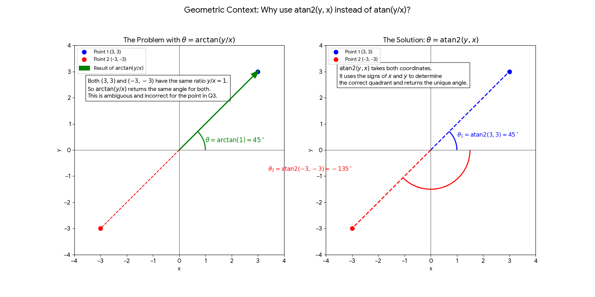

# atan2 Explained

## Putting tan(x) and arctan(x) in Geometric Context

## Get angle of position on a path using atan2

## Why use arctan(y, x) instead of arctan(y/x)?

## Other Trigonometric Functions

